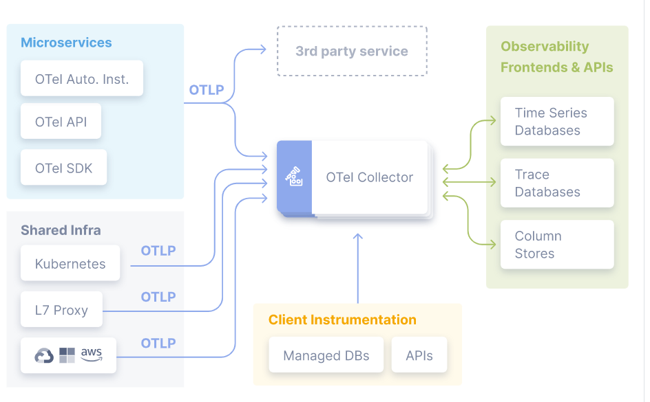

## how to use

```
./run.sh
```
wait tomcat server initialize finished

execute
```
curl -i http://localhost:8080/hello/path1
```
access jaeger
[jaeger](http://localhost:16686)
access grafana
[grafana](http://localhost:3000)


## OpenTelemetry basic concept



---

## Auto Instrumentation for java

```bash
# java agent setting
export OTEL_JAVAAGENT_LOGGING=application
export OTEL_LOGS_EXPORTER=otlp
# The place where javaagent location
export JAVA_OPTS="-javaagent:${PWD}/opentelemetry-javaagent.jar"

# java execution command
java $JAVA_OPTS \
-jar target/spring-boot-distributed-trace-jaeger-0.0.1-SNAPSHOT.jar \
--spring.application.name=Service-1 --server.port=8080 &
```
[Supported libraries, frameworks, application servers, and JVMs](https://github.com/open-telemetry/opentelemetry-java-instrumentation/blob/main/docs/supported-libraries.md)

## Annotaion for span and attribute

### Dependencies

#### Maven
```maven
<dependencies>
  <dependency>
    <groupId>io.opentelemetry.instrumentation</groupId>
    <artifactId>opentelemetry-instrumentation-annotations</artifactId>
    <version>1.27.0</version>
  </dependency>
</dependencies>
```
#### Gradle
```gradle
dependencies {
    implementation('io.opentelemetry.instrumentation:opentelemetry-instrumentation-annotations:1.27.0')
}
```

#### Code example
```java
import io.opentelemetry.instrumentation.annotations.WithSpan;
import io.opentelemetry.instrumentation.annotations.SpanAttribute;


public class MyClass {

    @WithSpan
    public void span(@SpanAttribute("param1") String param1)     {
        Span span = Span.current();
        span.addEvent("before print");
        logger.info("span param1: {}", param1);
        span.addEvent("after print");
    }
```

## Manual Instrumentation for span event

#### maven
```maven
<project>
    <dependencyManagement>
        <dependencies>
            <dependency>
                <groupId>io.opentelemetry</groupId>
                <artifactId>opentelemetry-bom</artifactId>
                <version>1.28.0</version>
                <type>pom</type>
                <scope>import</scope>
            </dependency>
        </dependencies>
    </dependencyManagement>
    <dependencies>
        <dependency>
            <groupId>io.opentelemetry</groupId>
            <artifactId>opentelemetry-api</artifactId>
        </dependency>
    </dependencies>
</project>
```
#### gradle
```gradle
dependencies {
    implementation 'io.opentelemetry:opentelemetry-api:1.28.0'
}
```
#### example
```java
import io.opentelemetry.api.trace.Span;

    @WithSpan
    public void span(@SpanAttribute("param1") String param1)     {
        Span span = Span.current();
        span.addEvent("before print");
        logger.info("span param1: {}", param1);
        span.addEvent("after print");
    }
```

#### Full code
```java
package com.example.demo.jaeger.controller;

import org.springframework.beans.factory.annotation.Value;
import org.springframework.http.ResponseEntity;
import org.springframework.web.bind.annotation.GetMapping;
import org.springframework.web.bind.annotation.RequestMapping;
import org.springframework.web.bind.annotation.RestController;
import org.springframework.web.client.RestTemplate;

import org.slf4j.Logger;
import org.slf4j.LoggerFactory;

import io.opentelemetry.instrumentation.annotations.WithSpan;
import io.opentelemetry.instrumentation.annotations.SpanAttribute;

import io.opentelemetry.api.trace.Span;

@RestController
@RequestMapping("/hello")
public class Controller {

    private static final Logger logger = 
    LoggerFactory.getLogger(Controller.class);

    private RestTemplate restTemplate;

    @Value("${spring.application.name}")
    private String applicationName;

    public Controller(RestTemplate restTemplate) {
        this.restTemplate = restTemplate;
    }

    @WithSpan
    public void span(@SpanAttribute("param1") String param1) {
        Span span = Span.current();
        span.addEvent("before print");
        logger.info("span param1: {}", param1);
        span.addEvent("after print");

    }

    @GetMapping("/path1")
    public ResponseEntity<String>  path1() {

        logger.info("Incoming request at {} for request /path1 ",
        applicationName);
        span("abc");
        String response = 
        restTemplate.getForObject("http://localhost:8090/hello/path2",
        String.class);
        return ResponseEntity.ok("response from /path1 + " + response);
    }

    @GetMapping("/path2")
    public ResponseEntity<String>  path2() {
        logger.info("Incoming request at {} at /path2", applicationName);
        return ResponseEntity.ok("response from /path2 ");
    }
}
```

# Demo
